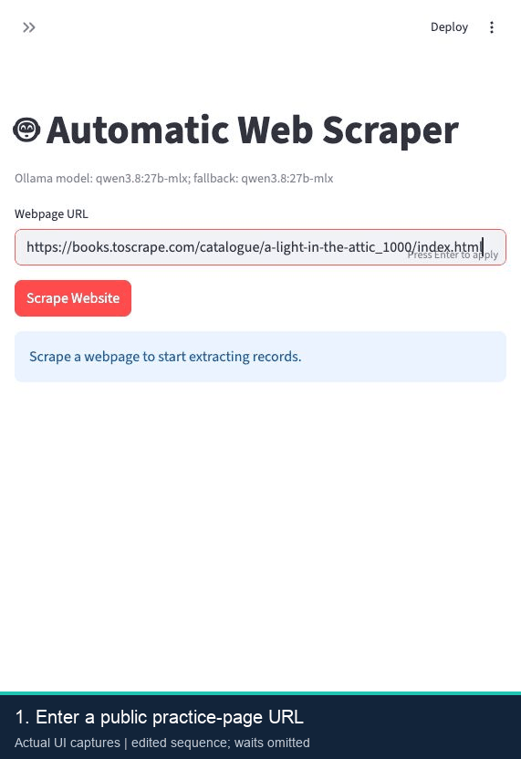

# Automatic Web Scraper with Local LLM Extraction

A local Streamlit application that captures public webpages with Selenium and extracts structured records using a configurable local LLM through Ollama. The default workflow produces a table and downloadable JSON with exact source quotes, block IDs and capture provenance. A separate free-text mode remains available.

Ollama is the model runtime, not a model name. The app's configuration defaults are `gpt-oss:20b` with `llama3.1:8b` fallback; the published extraction studies and current demo used the separately installed `qwen3.8:27b-mlx`. These results do not establish the quality of other models or arbitrary websites.

## Current capabilities

- **Browser capture:** non-empty content stability checks, optional CSS content selector, bounded retries, navigation/content timeouts and a supervised overall deadline.
- **Structured extraction:** 1–12 requested fields, schema-constrained JSON, semantic HTML blocks, exact source-quote validation and cross-chunk duplicate merging.
- **Inspect results:** value table, numbered source blocks, field evidence, actual model names, rejected records and explicit success/empty/partial/failed outcomes.
- **Export and diagnose:** structured JSON, free-text downloads, capture reports, and HTML/screenshots when the browser has time to retain them. The table also offers CSV export.
- **Reproducible evaluation:** isolated tests, actual Chrome integration tests, synthetic regression fixtures and a separate frozen/live public-demo-page study.

## Published evidence and scope

| Study | Observed result | Scope |
| --- | --- | --- |
| Paired extraction study | Field exact-match F1 **0.778 → 0.938** | 16 fixed synthetic HTML fixtures, same Qwen model; combined pipeline/configuration comparison |
| Public-page study | **6/6 captures**; field exact-match F1 **0.600** | Six permitted practice pages, ten scoped records / twenty fields; not a paired improvement study |

The higher synthetic-fixture score is not general web accuracy. Exact-match quote punctuation and record association remain concrete failure cases. [Synthetic report](evaluation/reports/structured_benchmark_20260930.json) · [Public-page report](evaluation/reports/public_web_20261008.json). Reproduction commands, raw responses and limitations appear below.

## Demo


Recorded from the current app on 8 October 2026 using local `qwen3.8:27b-mlx` and a [Books to Scrape practice page](https://books.toscrape.com/catalogue/a-light-in-the-attic_1000/index.html). The walkthrough shows a real title/price extraction, exact source quotes and block IDs, a verified JSON download, and a deliberately invalid CSS selector (`[`) with capture diagnostics.

**Edited screen-capture sequence:** waiting intervals are omitted and reading pauses added. The shown run took approximately **4.15 seconds to capture** and **14.03 seconds to extract**; these are single-run timings, not throughput or accuracy benchmarks. No model results are mocked. [Recording metadata](docs/demo-recording.json) documents the app version, input, observed output and timings.

## Quick start

Requires Python 3.10+, Chrome, and a running local Ollama installation with a model that can return the requested structured output. Model memory requirements depend on the model you choose.

```bash
git clone https://github.com/RockENZO/Automatic-web-scraper-with-LLM-parsing.git
cd Automatic-web-scraper-with-LLM-parsing
python -m venv .venv
# macOS / Linux:
source .venv/bin/activate
# Windows PowerShell alternative: .\.venv\Scripts\Activate.ps1
python -m pip install -r requirements.txt
```

Start Ollama using its installed app/service, or run `ollama serve` in another terminal if it is not already running. Use `ollama list` to identify exact installed model names. For the configuration defaults:

```bash
ollama pull gpt-oss:20b
ollama pull llama3.1:8b
python -m streamlit run main.py
```

To use a different installed model, set **both** primary and fallback deliberately. For the model used in the recorded demo, only if it is installed on your machine:

```bash
# macOS / Linux shell:
export OLLAMA_MODEL='qwen3.8:27b-mlx'
export OLLAMA_FALLBACK_MODEL='qwen3.8:27b-mlx'
python -m streamlit run main.py
```

In PowerShell, use `$env:OLLAMA_MODEL='YOUR_INSTALLED_MODEL'` and `$env:OLLAMA_FALLBACK_MODEL='YOUR_INSTALLED_MODEL'` instead. The benchmark's MLX-specific model tag is not assumed to be available from a standard `ollama pull` on every machine.

## Use the app

1. Enter a public HTTP(S) URL. The app captures one page; it does not crawl a whole website.
2. Keep **Structured records** selected. Adjust source chunk size or supply a CSS content selector when needed.
3. Click **Scrape Website**; inspect **Page capture details** and **View source blocks**.
4. Describe the desired records and provide comma-separated fields, for example `name,price`.
5. Click **Extract records** and review the table, status, rejected records and **Evidence and extraction details**.
6. Download JSON with provenance and evidence, or use the table's CSV export. Switch to **Free text** for text output through the legacy parsing path.

Example: capture the Books to Scrape page shown in the demo, request its book title and displayed price, and keep `name,price` as the fields. Source evidence confirms text presence, not correct interpretation or association; review important output.

## Configuration and recovery

| Setting | Current behavior |
| --- | --- |
| `OLLAMA_MODEL` / `OLLAMA_FALLBACK_MODEL` | Environment overrides for primary and fallback model names |
| `OLLAMA_BASE_URL` | Defaults to `http://localhost:11434`; changing it can send page content to the configured endpoint |
| Chunk size | Sidebar: 500–4,000 characters; default 3,000; not a token guarantee |
| Model requests | 60-second timeout, two attempts per model/chunk, one-second retry delay |
| Browser capture defaults | 12-second navigation, 10-second content, 40-second overall budget; up to two attempts; 0.75-second content stability |
| `CHROME_BINARY` / `CHROMEDRIVER` | Optional explicit paths to existing compatible executables |

Structured extraction uses the native `/api/generate` client in `ollama_client.py` (temperature 0, seed 42, 8,192-token context, 2,048-token output limit). Free-text parsing uses `langchain_ollama` and its generation settings from `config.py`. Those two paths do not use every configuration option identically.

Normal browser startup uses Selenium Manager. If driver provisioning fails, run `python setup_chromedriver.py`: the recovery utility uses `webdriver-manager`, tests `about:blank` and saves the verified path/version in ignored `runs/chromedriver.json`. Rerun it after a Chrome upgrade. Inspect capture outcomes instead of assuming driver setup or a stable loading placeholder proves a page is ready.

## Tests

```bash
python -m unittest discover -s tests -p 'test_*.py' -v
# Real Chrome against controlled local fixture pages:
RUN_BROWSER_TESTS=1 python -m unittest discover -s tests/browser -v
```

For PowerShell, set `$env:RUN_BROWSER_TESTS='1'` before the browser command. Initial driver provisioning may need internet. The reviewed suite has 33 isolated unit/UI/reference/driver tests and eight actual Chrome tests. CI separates them; they verify behavior, not extraction accuracy. `test_scraper.py` is an older manual integration check requiring Chrome, a live page and Ollama.

## Repository map

- `main.py`: Streamlit workflow, retained results and downloads.
- `scrape.py`, `browser_driver.py`, `setup_chromedriver.py`: bounded capture and driver resolution/recovery.
- `structured_content.py`, `structured_parse.py`, `ollama_client.py`: semantic blocks, structured extraction and native local-model requests.
- `content.py`, `parse.py`: free-text cleaning and legacy extraction path.
- `evaluation/`: frozen references, benchmarks, published reports and raw responses.
- `tests/`: isolated behavior tests; `tests/browser/`: actual Chrome tests.
- `runs/`: ignored generated captures and benchmark runs; `.venv/`: ignored local environment.

## URL policy and limits

The public capture API rejects private/localhost targets, embedded credentials and unusual ports. Browser tests inject an exact controlled localhost origin; that does not disable the default policy. Redirect checks occur after browser navigation and do not cover every subresource request or DNS rebinding. The application is a local tool; shared hosting would require outbound network controls and request limits.

There is no demonstrated general support for authenticated sites, CAPTCHA, pagination, unlimited scrolling or OCR. Arbitrary webpage instructions can influence a model, and exact source presence does not prove zero hallucinations or correct entity relationships. Predictions and diagnostics distinguish partial or failed work; review coverage and failure cases before using extracted data.

## License

Code is MIT licensed; see [LICENSE](LICENSE). Source pages retain their own terms and content rights.

## Extraction outcome and recovery

Parsing returns `ParseResult` with `status`, extraction `text`, chunk counts, failed chunk indices and actual models used. Success, no matches, partial extraction and total failure are displayed separately. A failure message is never offered as extracted data. Partial downloads are explicitly labelled. Progress updates after every processed chunk.

Fallback is attempted when an actual request fails, including connection and missing-model errors; creating a model object alone is not treated as proof it is available. Requests have a 60-second timeout, two attempts per model per chunk, and a one-second retry delay. Install both configured models with `ollama pull`, or set `OLLAMA_MODEL`, `OLLAMA_FALLBACK_MODEL` and `OLLAMA_BASE_URL`. The default chunk is 3,000 characters, maximum 4,000, with an 8,192-token model context; character limits are conservative and do not guarantee token fit for all languages.

```bash
python -m unittest discover -s tests -v
```

Parser tests use injected model doubles and cover fallback, all-failed, partial, empty, successful and invalid inputs without Chrome or Ollama. They verify control flow, not extraction accuracy. A real model may hallucinate or follow malicious webpage instructions; verify important output against the source. The application is a local demo; URL checks alone do not make Selenium safe to expose as a public scraping service.

## Structured records and source evidence

Structured mode is the default. Provide a task description and 1–12 comma-separated field names such as `name,price` or `name,email`. The model returns a schema-constrained JSON records array. Each non-null value must include a block ID and an exact source quote containing that value. Unknown values and their evidence must be `null`. Malformed output follows the existing bounded retry/fallback policy; unverifiable records are removed and reported explicitly.

`structured_content.py` preserves short values, article/list record boundaries, table row/header associations and visible contact details in headers or footers. Scripts, navigation and explicitly hidden markup are omitted. Ordinary records are packed whole within a character budget. Oversized individual blocks use overlapping windows; this cannot guarantee reconstruction of arbitrarily long records. Cross-chunk exact duplicate value objects are merged while retaining alternate evidence sets. Distinct entities with identical requested fields may also merge, so include an identity field when distinguishing them matters.

The UI displays values in a table and includes source blocks, field evidence, model names, rejected records, failed chunks and status in the JSON export. It retains the last extraction across reruns/downloads and clears it when another scrape starts. Failed extraction is not offered as successful data, and partial results are labelled.

Evidence checks prove that strings occur in visible canonical source text. They do not prove correct field semantics, correct association between entities, or immunity to prompt injection. This is still a local extraction tool, not a verified general-purpose web automation service.

### Reproduce the paired quality benchmark

The repository includes 16 manually specified **synthetic HTML regression fixtures**, covering products, tables, one-character values, contacts, missing fields, duplicate listings, multilingual text, hidden/script content, no matches, boundary-spanning input and instruction-like webpage text. Expected records are defined before model execution. These fixtures are not a representative sample of real websites.

```bash
python -m pip install -r requirements-benchmark.txt
# Install/start an Ollama model, then choose its exact name from ollama list.
python evaluation/benchmark.py --model YOUR_INSTALLED_MODEL
```

The benchmark alternates old/new execution order and uses the same model, temperature 0, seed 42, 8,192-token context, 2,048-token output limit and 1,400-character source budget. The baseline is the former cleaning/character-splitting/free-text pipeline, explicitly asked for JSON so it receives the same target field definitions. It permits Markdown fences and concatenated JSON but does not repair values or remove duplicates. The improved pipeline adds semantic blocks, native structured output, evidence validation and deduplication together; this is a combined configuration comparison, not a single-component ablation.

Reports record input/code hashes, installed model digest, each prediction, chunk failures, rejected records, exact-match quality and whole-extraction latency. The output directory cannot be overwritten. A rerun on another model or device is a separate experiment. No live browser fetch, OCR, pagination or CAPTCHA handling is measured by this benchmark.

For structured extraction with the benchmark's installed model, configure both primary and fallback deliberately (the measured run uses the same model for both):

```bash
export OLLAMA_MODEL='qwen3.8:27b-mlx'
export OLLAMA_FALLBACK_MODEL='qwen3.8:27b-mlx'
streamlit run main.py
```

Use a model actually available on your machine; the default `gpt-oss:20b` and `llama3.1:8b` are supported configuration choices, not models validated by this benchmark.

### Measured paired result (2026-09-30)

Actual local model: `qwen3.8:27b-mlx`, digest `5642e97495e1a088883805981563dcdc4a040c2f53388b7a41d1f24d3622cf7e`. One frozen run on all 16 fixtures, with 24 unique expected records and 51 non-null expected fields:

| Metric | Legacy pipeline | Structured pipeline |
| --- | ---: | ---: |
| Field exact-match precision | 0.89744 | 1.00000 |
| Field exact-match recall | 0.68627 | 0.88235 |
| Field exact-match F1 | 0.77778 | **0.93750** |
| Record exact-match F1 | 0.72727 | **0.93333** |
| Values unsupported by visible canonical source | 4 / 39 | 0 / 45 |
| Whole extraction time across 16 cases | 147.75 s | 248.25 s |
| Model calls including retries | 17 | 20 |
| Cases returning no usable result | 1 | 2 |

Fields are scored as a multiset of `(first requested field, field name, verbatim value)` triples, so mixing attributes from different records is penalized. Records require every requested field (including nulls) to match. Duplicate predictions count as additional false positives. Empty-match cases are checked separately. Free-text output that cannot be decoded into the requested JSON records is counted as an unusable case; no values are inferred from malformed responses.

The improved run recovered table short values, header/footer contacts and the boundary record, and excluded hidden listings. It missed the `script_noise` and `row_headers` cases. Their raw responses and failure/rejection details are preserved. Strict evidence validation can remove useful answers when model citations are incorrect; native structured generation can also fail or return malformed records. The aggregate quality gain comes with **about 68% more extraction wall time** in this run.

Zero unsupported returned values is a lexical source-presence result, not proof of zero hallucinations, semantic correctness or prompt-injection resistance. The fixture set is small and synthetic, and does not establish live-web performance or production readiness.

[Full metrics and per-case predictions](evaluation/reports/structured_benchmark_20260930.json) and [raw model responses / grounded records](evaluation/reports/raw_responses_20260930.jsonl) are included with hashes. Generated runs remain local under `runs/structured-benchmark/`.

**Resume wording:** “Built a source-verifiable local LLM extraction pipeline with semantic HTML blocks, structured JSON and duplicate merging; on 16 fixed synthetic regression fixtures, improved field exact-match F1 from 0.778 to 0.938 and record F1 from 0.727 to 0.933, with published raw responses and latency tradeoffs.”

## Browser reliability and real-page evaluation (2026-10-08)

### Capture behavior

The app now uses `scrape_page()` and a structured `ScrapeResult`. The original `scrape_website()` remains an HTML-returning compatibility wrapper; its optional `wait_time` is now a content deadline, not a fixed sleep.

- Defaults: 12-second navigation timeout, 10-second content timeout, 40-second overall budget, 0.75-second non-empty content stability and at most two attempts. Retry backoff is 0.5 seconds; all attempts share the overall budget.
- Specify a CSS content selector for dynamic pages. Without one, the heuristic watches non-empty visible `main`, `article` or `[role=main]` text and falls back to body text if those candidates are empty or hidden. An explicit selector never falls back to unrelated body content. A stable loading placeholder can still appear ready; stability does not prove that every asynchronous record has arrived.
- Each attempt uses a fresh Chrome session. Selenium Manager provisions the driver by default; `CHROMEDRIVER` and `CHROME_BINARY` can supply known local binaries. A successful `python setup_chromedriver.py` persists its verified driver path and browser version in ignored `runs/chromedriver.json`, which subsequent captures reuse before invoking Selenium Manager. Missing or mismatched saved drivers fall back to Manager; rerun setup after a Chrome upgrade. Chrome's sandbox is enabled by default.
- A supervised child process bounds driver startup, DNS checks, navigation, content polling and artifact capture. POSIX process groups are terminated on completion/timeout; cleanup has a short grace period. Windows tree termination is implemented but not verified by this macOS/Linux test matrix.
- Outcomes distinguish invalid/public-policy-rejected URLs, blocked final redirects, navigation/content/overall timeouts, empty content, invalid selectors, excessive HTML, network/browser failures and worker crashes. Configuration/policy failures are not retried.
- HTML/screenshot diagnostics are retained when capture has time to produce them, together with attempt outcomes, requested/final URL, browser version, elapsed time and an HTML hash. A hard startup/deadline failure may have no screenshot. Generated artifacts live under ignored `runs/browser/`.
- The UI preserves capture diagnostics across reruns, shows the browser screenshot and provides HTML/report downloads. Extraction exports include capture provenance and the final source URL. Failure diagnostics are not extracted records.

Redirect policy is checked after navigation/URL changes, not before every browser network request. It does not prevent an initial redirected/subresource request or DNS rebinding. Shared hosting still requires network egress controls; this remains a local tool.

```bash
python -m pip install -r requirements-browser.txt
python -m unittest discover -s tests -p 'test_*.py'
# Actual browser tests; Selenium Manager may need internet for initial provisioning.
RUN_BROWSER_TESTS=1 python -m unittest discover -s tests/browser -v
```

The eight browser tests use an explicitly injected **exact localhost origin** on a controlled server. The UI and default capture API continue to reject private URLs. These tests measure delayed content, unstable/empty targets, redirects, retries, invalid CSS and navigation/overall deadlines; they are not public-web accuracy evidence. The browser test suite provisions Chrome before timing individual scenarios. CI runs them separately from the 33 isolated unit/UI/reference/driver tests.

### Frozen versus live public-page benchmark

[evaluation/public_pages.json](evaluation/public_pages.json) specifies six permitted public practice pages across three hosts: three book detail pages, static and JavaScript quote pages, and a countries page. The quote views intentionally share content to exercise JavaScript capture. This is a small demo-site sample, not six independent real-world applications.

Reference fields are joined within each record using predefined DOM selectors, then frozen **before LLM inference**. Model inputs are explicitly bounded to the first 1–3 record regions per page (10 records / 20 non-null fields in total). This does not benchmark whole-site extraction, pagination, authentication, CAPTCHA, OCR or unlimited scrolling. Source URLs, hashes and reference rules are retained. Full capture HTML/screenshots remain local; small model-input snapshot regions are committed for reproduction.

```bash
# Freeze a new dated dataset; never overwrite existing evidence.
python evaluation/public_benchmark.py freeze --output runs/public-web/frozen
# Reproduce extraction from committed snapshots without invoking a browser:
python evaluation/public_benchmark.py evaluate \
  --dataset evaluation/public_snapshots/20261008 \
  --output runs/public-web/frozen-only --model YOUR_INSTALLED_MODEL --mode frozen
# Both modes: frozen snapshots and a new live browser pass, alternating order.
python evaluation/public_benchmark.py evaluate \
  --dataset evaluation/public_snapshots/20261008 \
  --output runs/public-web/both --model YOUR_INSTALLED_MODEL --mode both
```

Mutation of frozen snapshots is rejected. Live reference drift—including missing record regions, missing fields or empty fields—is reported and excluded from quality scoring, without calling the model. When every reference drifts, quality rates are null rather than a zero-accuracy claim. Actual browser capture failures are included as missed expected records when the reference remains valid. Field scoring uses the first requested field as the record-identity anchor, so a changed anchor also penalizes associated fields. No semantic normalization or post-result reference editing is applied.

Actual model: `qwen3.8:27b-mlx`, digest `5642e97495e1a088883805981563dcdc4a040c2f53388b7a41d1f24d3622cf7e`, local MLX runner. Chrome `154.0.8037.97`, Selenium `4.50.0`, Python `3.12.13` on macOS. The same extractor, model and frozen references were used in both modes:

| Measurement | Frozen regions | Live browser + scoped extraction |
| --- | ---: | ---: |
| Public-page capture success | Not applicable | 6 / 6 |
| Field exact-match precision / recall / F1 | 0.600 / 0.600 / 0.600 | 0.600 / 0.600 / 0.600 |
| Record exact-match F1 | 0.600 | 0.600 |
| Whole-run extraction/capture time, summed over cases | 116.82 s | 133.15 s |
| Returned values absent from canonical source | 0 | 0 |

The book and country records match exactly. In both quote views, the model omits the displayed outer quotation marks. The frozen reference retains them, so the quote identity anchor and associated author field count as mismatches even though authors are correctly named. Raw responses, returned records and scores are preserved in [public_web_20261008.json](evaluation/reports/public_web_20261008.json). This lexical metric is not a semantic judgment, and zero unsupported strings is not proof of zero hallucinations.

These measurements are **not a paired legacy improvement result** and cannot be compared directly with the earlier 16 synthetic fixtures. Successful capture on six scoped demo pages does not establish production readiness. The next extraction-quality study should reserve new evaluation pages before changing prompts or normalization rules in response to these failures.


### Review hardening

Benchmark metadata tolerates absent optional packages (for example Streamlit/Selenium during frozen-only evaluation), recording their versions as null instead of failing after model inference. Provenance is captured before processing: code hashes include the scoring/client module, configuration, URL policy and driver resolver, and effective inference settings include context, generation limits, retries, timeout and an endpoint hash. Existing published reports remain historical evidence from their recorded code version; these fixes do not replace their responses or scores.
